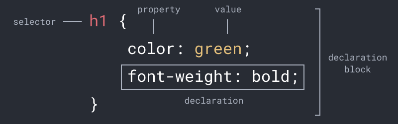
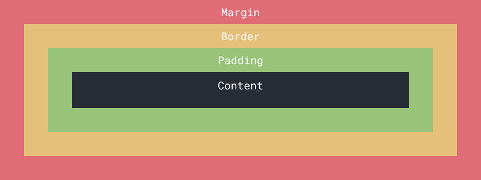

[<](README.md)


# CSS Reference

- CSS ("Cascading stylesheets") is the language used to control the display of HTML elements.
- Usually stored in separate `.css` files [linked](https://www.w3schools.com/Css/css_howto.asp) in the `head`, CSS can also be added directly to the page `head` in `style` tags, or to elements themselves.
- The name describes how some styles have priority based on their specificity. If more than one rule is applied to an element then styles with higher specificity "cascade" over others. Below, the `h1` rule is more specific than the body, so its color will be purple.


## CSS document

Save the following text in a file called `styles.css` inside `assets/css/`

```css
body {
	color: black;
	background-color: lightblue;
}
h1 {
	color: purple;
	text-align: center;
}
p {
	font-family: verdana;
	font-size: 20px;
}
```


## CSS Anatomy
An example CSS rule




## CSS Terms

Term | Definition
--- | ---
[Rules](https://www.w3schools.com/Css/css_syntax.asp) | A CSS rule-set consists of a selector and a declaration block (e.g. above, `body { background-color: lightblue; }` is a rule-set
[Selectors](https://www.w3schools.com/css/css_syntax.asp) | Selects the HTML elements you want to style. (e.g. the `p` in the example above selects all `<p>` elements on the page)
[Declaration](https://www.w3schools.com/css/css_syntax.asp) | The declaration includes a CSS property name and a value, separated by a colon. (in the example above `font-family: verdana;` is a declaration)
[Declaration block](https://www.w3schools.com/css/css_syntax.asp) | A "block" of one or more declarations (in the example above, everything between and include the curly braces `{}` is the declaration block)
[Property](https://www.w3schools.com/css/css_syntax.asp) | CSS properties describe what aspect of an element is being modified (in the example above `font-family` is a property)
[Value](https://www.w3schools.com/css/css_syntax.asp) | The value describes how the property will be changed (in the example above `verdana` is a value)


## CSS Selectors
Common CSS selectors

Selector | Definition
--- | ---
[`*`](https://www.w3schools.com/css/css_selectors.asp) | Select every element on the page
[`p`](https://www.w3schools.com/css/css_selectors.asp) | Select all paragraph elements
[`.callout`](https://www.w3schools.com/css/css_selectors.asp) | Select all elements with the class `callout`
[`p.callout`](https://www.w3schools.com/css/css_selectors.asp) | Select *only* paragraph elements with the class `callout`
[`div, h1`](https://www.w3schools.com/css/css_selectors.asp) | Select all `div` elements and `h1` elements
[`div h1`](https://www.w3schools.com/css/css_selectors.asp) | Select only `h1` elements *inside* `div` elements


## CSS Box Model

- The CSS box model defines the containing box for every HTML element.
- It includes (starting from the outside) the margin, border, padding, and content of every [box-level element](https://www.w3schools.com/html/html_blocks.asp).




## CSS Properties
Common CSS properties and example values


### Comments

Comments are helpful for documenting your code so you (and others) recall what it does. You can add single or multiline comments to CSS inside `/*` and `*/` characters.

```css
/* this will not affect the style */
p { color: green; } /* neither will this */
/* this is a
multiline
comment */
```


### Margin & padding

This example uses [`margin`](https://www.w3schools.com/css/css_margin.asp) to define the space outside the content and border of an element. The vertical margin is `20px` and the horizontal margin is `10px`;

 ```css
p {
	margin-top: 20px;
	margin-right: 10px;
	margin-bottom: 20px;
	margin-left: 10px;
}
 ```

[Shorthand](https://developer.mozilla.org/en-US/docs/Web/CSS/Shorthand_properties) properties let you combine multiple values in a single declaration. With the [`margin`](https://www.w3schools.com/css/css_margin.asp) shorthand you can write all the declarations above on a single line, saving not only time but bandwidth. The `margin`, `border`, and `padding` shorthands are listed in clockwise order from the top.

```css
p { margin: 10px; } /* set all margins to 10px */
p { margin: 20px 10px; } /* set top/bottom margins to 20px and left/right to 10px */
p { margin: 2px 4px 6px 8px; } /* set them all */
```


Set [`padding`](https://www.w3schools.com/css/css_padding.asp), the space outside content and inside border, of all `h3` elements. `padding` is shorthand for `padding-top`, etc.

```css
h3 { padding: 10px; } /* set all padding to 10px */
```


### Background

Set `background-` [`color`](https://www.w3schools.com/css/css_background.asp), [`image`](https://www.w3schools.com/css/css_background_image.asp), [`repeat`](https://www.w3schools.com/css/css_background_repeat.asp), and [`position`](https://www.w3schools.com/css/css_background_repeat.asp) for the entire web page `body`.

```css
body {
	background-color: #ffffff;
	background-image: url("img_tree.png");
	background-repeat: no-repeat;
	background-position: right top;
}
```

Shorthand for [`background`](https://www.w3schools.com/css/css_background_shorthand.asp) looks like this:

```css
body {
	background: #ffffff url("img_tree.png") no-repeat right top;
}
```


### Border

CSS `border-` [`width`](https://www.w3schools.com/css/css_border_width.asp), [`style`](https://www.w3schools.com/css/css_border.asp), and [`color`](https://www.w3schools.com/css/css_border_color.asp) properties define the display of the space between padding and margin.

```css
p {
	border-width: 5px;
	border-style: solid;
	border-color: red;
}
```

There is also a [`border`](https://www.w3schools.com/css/css_border.asp) shorthand.

```css
p { border: 5px solid red; }
```

This class will set the [`border-radius`](https://www.w3schools.com/cssref/css3_pr_border-radius.asp) to define how round corners of an element appear.

```css
.rounded { border-radius: 10px; }
```


### Text

Set the `font-` [`family`](https://www.w3schools.com/css/css_font.asp), [`size`](https://www.w3schools.com/css/css_font.asp), [`style`](https://www.w3schools.com/css/css_font.asp), [`weight`](https://www.w3schools.com/css/css_font.asp), [`line-height`](https://www.w3schools.com/cssref/pr_dim_line-height.asp), [`text-align`](https://www.w3schools.com/css/css_align.asp), and [`color`](https://www.w3schools.com/css/css_colors.asp) the text where `id` is `logo`.

```css
#logo {
	font-family: Arial, Helvetica, sans-serif; /* Displays the first available font */
	font-size: 12px;
	line-height: 16px;
	font-style: italic;
	font-weight: bold;
	text-align: left;
	color: purple;
}
```

The shorthand for [`font`](https://www.w3schools.com/css/css_font_shorthand.asp) combines `line-height` property as well.

```css
#logo { font: 12px/16px Arial; }
```


### Position

The [`position`](https://www.w3schools.com/css/css_positioning.asp) property determines how an element is displayed. Elements are positioned `static` by default and will follow the normal flow of the page. This rule will affect only `div` elements with the class `static`.

```css
div.static {
	position: static;
	border: 3px solid green;
}
```


Changes position `relative` to its parent's position. This will allow you to use `top`, `left`, `bottom`, or `left` properties to offset the position. This class will set position relative and move it 30px to the right of its parent position.

```css
div.relative {
	position: relative;
	left: 30px;
	border: 3px solid green;
}
```

Position `fixed` breaks the element from the flow of the page and makes it relative to the viewport, so it stays in place if the page is scrolled. This class will "fix" the element to the bottom right of the page.

```css
div.fixed {
	position: fixed;
	bottom: 0;
	right: 0;
	width: 300px;
	border: 3px solid green;
}
```


`absolute` positioned elements are removed from the normal flow of the page, yet *they move* along with the scroll and can overlap elements. Their new position is relative to nearest positioned ancestor. If this class is inside a relative position element, it will be relative to that element. Otherwise it will be relative to the document body.

```css
div.absolute {
	position: absolute;
	top: 80px;
	right: 0;
	width: 200px;
	height: 100px;
	border: 3px solid green;
}
```


[`z-index`](https://www.w3schools.com/cssref/pr_pos_z-index.asp) specifies stack order elements and can overlap others. An element with greater stack order is always in front of an element with a lower stack order. This element will always be at the top left of the page, overlapping all other content (with lower z-index values).

```css
#logo {
	position: absolute;
	left: 0px;
	top: 0px;
	z-index: 100;
}
```


View the [full W3Schools CSS Reference](https://www.w3schools.com/cssref/default.asp)


## CSS Validation

- The latest CSS standard released was 2.1 (in 2016!) but all [major browsers support *almost* all of CSS 3.0](https://caniuse.com/?search=css3).
- The W3C [CSS](https://jigsaw.w3.org/css-validator/) defaults to 3.0 but allows you to select other versions.
- When validating CSS while using Bootstrap only worry about *your* CSS files. Bootstrap's built-in support for older browsers will not validate, but *will* ensure your pages look the same across major browsers.


## References

Critical Web Design Tutorials and references

- [HTML](html.md), [CSS](css.md), and [Javascript](javascript.md) reference sheets
- [HTML/CSS slides](https://docs.google.com/presentation/d/1x5yJObVVAyUj2uUV3VKqxvY1L2ucPrwKDUFKmZ2elUw/edit?usp=sharing)
- [Introduction to course concepts & software slides](https://docs.google.com/presentation/d/1OVCMHMfB_0gYgTtv2iMK_aCktJtCSRp1aRvH3T1W0JU/edit?usp=sharing)

Popular tutorials and guides - You should **still look for other ones that you might like better**!

- W3Schools [HTML](https://www.w3schools.com/html/) and [CSS](https://www.w3schools.com/css/)
- MDN [Learn web development](https://developer.mozilla.org/en-US/docs/Learn), [HTML](https://developer.mozilla.org/en-US/docs/Web/HTML), [CSS](https://developer.mozilla.org/en-US/docs/Web/CSS)
- Shay Howe's *[Learn to Code HTML & CSS](https://learn.shayhowe.com/)*
- Oliver James' *[HTML & CSS Is Hard (But Doesn't Have To Be)](https://www.internetingishard.com/html-and-css/)*
- Jessica Hische and Russ Maschmeyer's *[Don't Fear The Internet](http://www.dontfeartheinternet.com/)*
- [Learn web development as an absolute beginner (2021)](https://coder-coder.com/learn-web-development/)

Technical references - The most accurate and comprehensive way to understand a code language.

- W3Schools Reference [HTML](https://www.w3schools.com/tags/default.asp), [CSS](https://www.w3schools.com/cssref/default.asp)
- MDN Reference [HTML](https://developer.mozilla.org/en-US/docs/Web/HTML/Reference), [CSS](https://developer.mozilla.org/en-US/docs/Web/CSS/Reference)
- [htmlreference.io](https://htmlreference.io/) and [cssreference.io](https://cssreference.io/)
