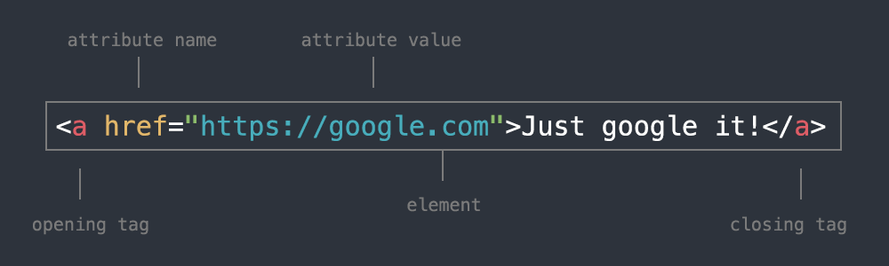

[<](README.md)


# HTML Reference

- HTML is short for HyperText Markup Language and describes the structure of web pages.
- HTML elements tell the browser how to display the content they contain or "wrap".
- HTML elements are represented by tags which label pieces of content such as `<p>` (paragraph), `<h1>` (heading), etc.


## An example HTML page
```
<!DOCTYPE html>
<html lang="en">
<head>
    <!-- meta tags, links to css, etc. -->
    <title>Critical Web Design</title>
</head>
<body>
    <!-- visible content goes here -->
    <p>Hello world!</p>
</body>
</html>
```


## HTML Anatomy





## HTML Terms

Term | Definition
--- | ---
[Element](https://www.w3schools.com/html/html_elements.asp) | The element includes the opening tag, content between, and the closing tag. (e.g. `<b>Content</b>`)
[Tag](https://www.w3schools.com/html/html_elements.asp) | The opening or closing part of an HTML element. Can be an opening, closing, or self-closing tag. (e.g. `<b>`)
[Attribute](https://www.w3schools.com/html/html_attributes.asp) | Provide additional information to HTML elements. Attributes are specified in the start tag and usually come in name/value pairs like: name="value". (e.g. `<a href="https://google.com">Google</a>` )
[Whitespace](https://www.w3schools.com/html/html_entities.asp) | Spaces, tabs, and carriage returns are examples of whitespace you use in writing HTML. When the browser renders this page all whitespace will be collapsed to a single space.
[Block-level](https://www.w3schools.com/html/html_blocks.asp) | HTML elements have default `display` values depending the element type. A `block-level` element (e.g. `<div>`) always starts on a new line and takes up the full width of its parent element. `Inline elements` (e.g. `<span>`) do not start on a new line and only take as much width as necessary.
[Bookmarks](https://www.w3schools.com/html/html_links.asp) | a.k.a. "targeted anchors" are used to allow readers to jump to specific parts of a Web page when clicked. (e.g. clicking `<a href="#section2">Jump to section 2</a>` will jump to `<p id="#section2">Content</p>`)
[Absolute URLs](https://www.w3schools.com/html/html_links.asp) | Absolute URLs are the full path or "web address" and always start with `https://` or `file:///`. (e.g. `https://google.com`)
[Relative URLs](https://www.w3schools.com/html/html_links.asp) | Relative URLs are *relative* path from one file to another. (e.g. `images/cat.png` or `../section2/file.html`)
[Comments](https://www.w3schools.com/html/html_comments.asp) | Comments in HTML can be used to make notes about the code but do not appear on the web page. In the example above `<!-- visible content goes here -->` is a comment and not visible to users.


## HTML Elements
Examples of common HTML elements

Term | Definition
--- | ---
[`<html>`](https://www.w3schools.com/html/html_intro.asp) | The root element of an HTML page
[`<head>`](https://www.w3schools.com/html/html_intro.asp) | Contains meta information about the document
[`<title>`](https://www.w3schools.com/html/html_intro.asp) | The title element goes in the `<head>` and appears at the top of the browser tab
[`<body>`](https://www.w3schools.com/html/html_intro.asp) | Contains the visible page content
[`<p>`](https://www.w3schools.com/html/html_paragraphs.asp) | A paragraph
[`<br>`](https://www.w3schools.com/html/html_paragraphs.asp) | A line break
[`<ul>`](https://www.w3schools.com/html/html_lists.asp) | An unordered list. List items within this element appear as bullets.
[`<ol>`](https://www.w3schools.com/html/html_lists.asp) | An ordered list. List items within this element appear with numbers.
[`<li>`](https://www.w3schools.com/html/html_lists.asp) | A list item


## References

Critical Web Design Tutorials and references

- [HTML](html.md), [CSS](css.md), and [Javascript](javascript.md) reference sheets
- [HTML/CSS slides](https://docs.google.com/presentation/d/1x5yJObVVAyUj2uUV3VKqxvY1L2ucPrwKDUFKmZ2elUw/edit?usp=sharing)
- [Introduction to course concepts & software slides](https://docs.google.com/presentation/d/1OVCMHMfB_0gYgTtv2iMK_aCktJtCSRp1aRvH3T1W0JU/edit?usp=sharing)

Popular tutorials and guides - You should **still look for other ones that you might like better**!

- W3Schools [HTML](https://www.w3schools.com/html/) and [CSS](https://www.w3schools.com/css/)
- MDN [Learn web development](https://developer.mozilla.org/en-US/docs/Learn), [HTML](https://developer.mozilla.org/en-US/docs/Web/HTML), [CSS](https://developer.mozilla.org/en-US/docs/Web/CSS)
- Shay Howe's *[Learn to Code HTML & CSS](https://learn.shayhowe.com/)*
- Oliver James' *[HTML & CSS Is Hard (But Doesn't Have To Be)](https://www.internetingishard.com/html-and-css/)*
- Jessica Hische and Russ Maschmeyer's *[Don't Fear The Internet](http://www.dontfeartheinternet.com/)*
- [Learn web development as an absolute beginner (2021)](https://coder-coder.com/learn-web-development/)

Technical references - The most accurate and comprehensive way to understand a code language.

- W3Schools Reference [HTML](https://www.w3schools.com/tags/default.asp), [CSS](https://www.w3schools.com/cssref/default.asp)
- MDN Reference [HTML](https://developer.mozilla.org/en-US/docs/Web/HTML/Reference), [CSS](https://developer.mozilla.org/en-US/docs/Web/CSS/Reference)
- [htmlreference.io](https://htmlreference.io/) and [cssreference.io](https://cssreference.io/)
