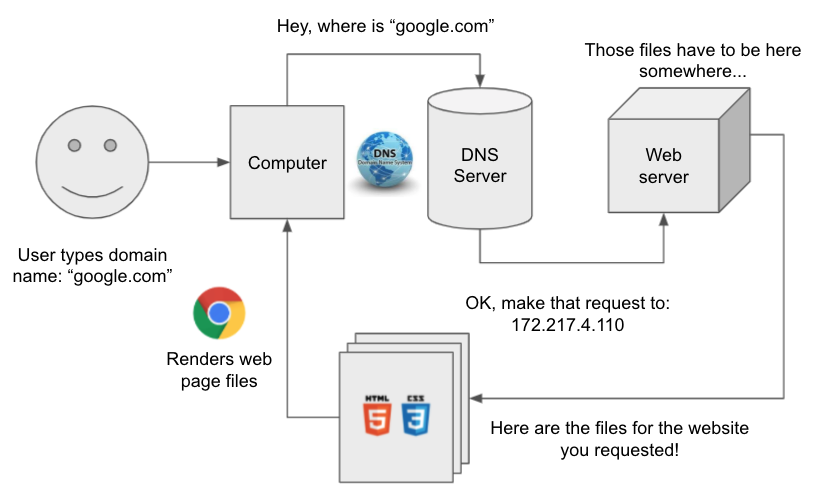
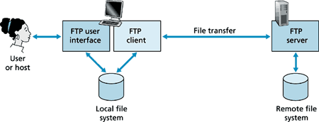
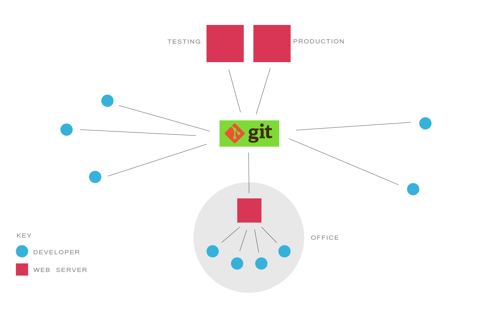

[<](README.md)

# Web Servers

An overview of the DNS, servers, CDNs, FTP, and more.

### Contents

1. [Learning Objectives](#learning-objectives)
1. [Introduction](#introduction) `5 min`
1. [Discussion](#discussion) `5 min`
1. [References](#references)

## Learning Objectives

Students who complete the following will be able to:

- Discuss the difference between the WWW and the Internet
- Describe the essential components of today's internet system
- Recall
- Demonstrate how to publish a website

## What is a website?

A website consists of several parts:

- The files: HTML and CSS code, the text or data for the website, and all assets like images, scripts, and other media files.
- A public web server which “hosts” or “serves” those files to computers that request your website.*
- An easy to remember domain name, like “google.com,” that you register so users can request your website files.*
- The domain name system (DNS), where your registered domain name points to your physical server or cloud operation.
- Git or an SFTP application to put and update the files that make up your website.
- Finally, the HTML and CSS code you write are just plain text files until someone actually uses a web browser to render them.

### WWW vs The Internet

### Essential Web Technology

- Packet Switching
- TCP/IP

## The Cloud

- blah

## Domain Name System (DNS)

The Domain Name System (DNS) is a central part of the Internet, providing a way to match names (the website you’re seeking) to numbers (the IP address for the website).

### Discussion

- Use PING to see this in action...

## Web Hosting

When you register your domain name you tell the domain name registrar the address of your server.
When a user requests files from your site then your computer makes a request to your web host, which returns those files for the browser to render.

## Domain name availability

- Use a whois service to check the availability of the domain name you want to use.
- For example, this site is not available davidson.edu

## Publishing

### FTP / SFTP

Using FTP (File Transfer Protocol) to manage server files but there are drawbacks:

- Manual process takes longer
- Easier to make mistakes
- No backups

### Git

Publishing a website on a server with Git / Github makes it much easier to maintain projects.

- Automated tools
- Entire project is duplicated
- You can control versions
- You always have backup if you make a mistake

## CDN

A content delivery network can speed up your websites but they also create caching issues.

### Caching

- Browsers, switches, ISPs, CDNs all use caches to speed up content delivery.
- As a developer you do not want to see the cached content. Hold SHIFT and click refresh.

## Discussion

-

## References

-
