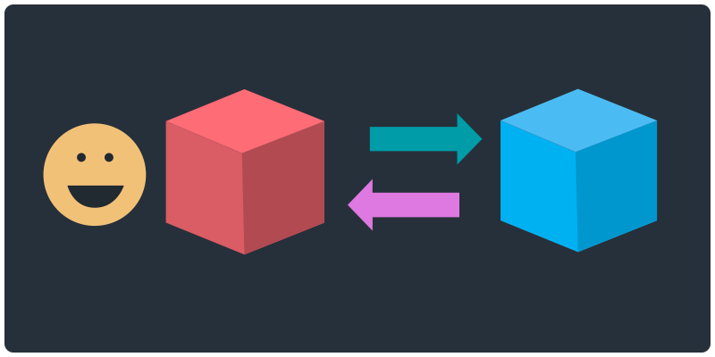

[<](README.md)

# Web Servers

An overview of the DNS, servers, CDNs, FTP, and more.

### Contents

1. [Learning Objectives](#learning-objectives)
1. [Introduction](#introduction) `5 min`
1. [Discussion](#discussion) `5 min`
1. [References](#references)

## Learning Objectives

Students who complete the following will be able to:

- Discuss the difference between the WWW and the Internet
- Describe the essential components of today's internet system
- Recall
- Demonstrate how to publish a website

## Introduction

-

WWW vs The Internet
TCP/IP
DNS

FTP

The Cloud

## Discussion

-

## References

-
