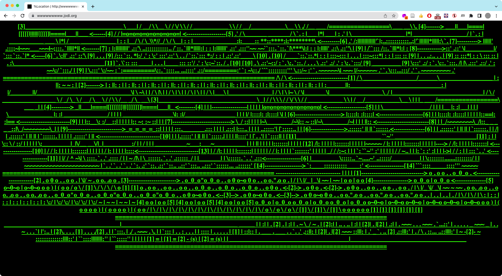
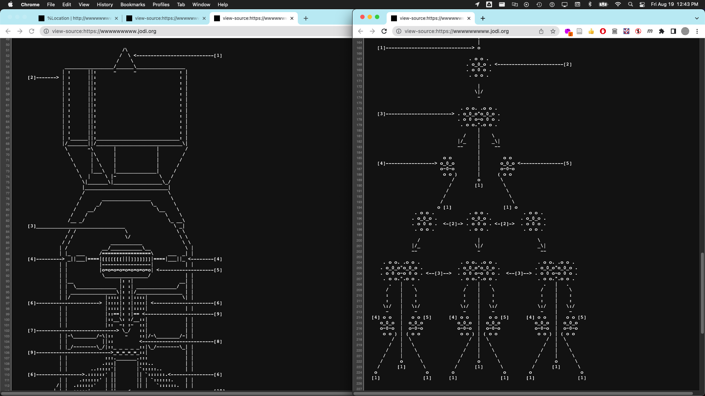

[<](../../README.md)

# Critical Design

See this presentation
https://docs.google.com/presentation/d/1OWc_e1pquvwKi4qxJShsZ1Rqia1dbDBcwpxYwdOic7o/edit#slide=id.g2830aed7f5_0_0

<!--
---

### wwwwwwwww&#46;jodi&#46;org

<a href="http://wwwwwwwww.jodi.org" target="_blank">wwwwwwwww.jodi.org</a> by JODI (1995) takes advantage of a technical aspect of web pages — that whitespace in HTML is not rendered — to encourage viewers to consider the structures underneath the shiny veneer of the web.

-->
