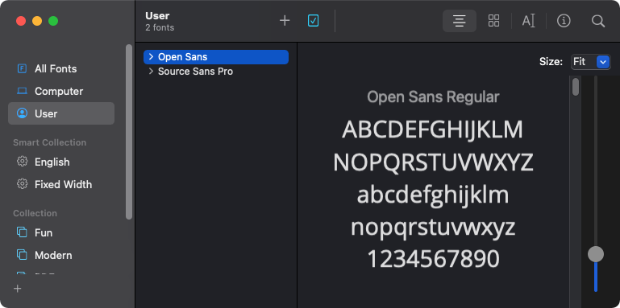

[<](../../README.md)

# Web Design

## Presentations

- [Responsive Web Design](https://docs.google.com/presentation/d/1BiIHVEQjmIb2k2vB6N3x1g_S3KSLyZq2YCniq1ONjg8/edit#slide=id.p)
- [Identity & Branding](https://docs.google.com/presentation/d/1exnY8fjVsOc3bKZFESJIM2s4JKxhqg_oASPDPokSfrE/edit#slide=id.p)

## Design Critiques

1. [Design Critique: Three things](https://docs.google.com/presentation/d/1BiIHVEQjmIb2k2vB6N3x1g_S3KSLyZq2YCniq1ONjg8/edit#slide=id.ga1e6b74fb3_0_5)
1. [Design Critique: Visual Hierarchy](https://docs.google.com/presentation/d/1BiIHVEQjmIb2k2vB6N3x1g_S3KSLyZq2YCniq1ONjg8/edit#slide=id.g6c9d5c036c_0_13)
1. [Design Critique: Eye Movement Test](https://docs.google.com/presentation/d/1BiIHVEQjmIb2k2vB6N3x1g_S3KSLyZq2YCniq1ONjg8/edit#slide=id.gf16dac508b_0_0)
1. [Design Critique: Final design checklist](https://docs.google.com/presentation/d/1BiIHVEQjmIb2k2vB6N3x1g_S3KSLyZq2YCniq1ONjg8/edit#slide=id.gf7e0af7835_0_0)

## Moodboards

Creating a moodboard will help you collect and flesh out visual ideas for your project.

- [Moodboarding 101: Build beautiful & effective moodboards for your design projects](https://dribbble.com/stories/2020/11/06/how-to-create-moodboards)

## Color

- [Coolers](https://coolors.co/) - Color scheme generator

## Fonts

How to install fonts on your computer

1. Download the font files. For example, click Download Family on [the Open Sans typeface page](https://fonts.google.com/specimen/Open+Sans?query=open+sans).
1. Open the .zip file
1. On Mac, open Font Book and choose File > Add fonts..
1. Select all the fonts in the folder and add them. Fonts installed on your computer will appear under the User tab.

<!--

## Design Inspiration

### Studios & Agencies

- [hellomonday.com](https://www.hellomonday.com/)
- [animade.tv](https://animade.tv/)
- [divergentdesignlab.org](https://divergentdesignlab.org/)
- [deptagency.com](https://www.deptagency.com/en-us/)
- [stefanieposavec.com](https://www.stefanieposavec.com/) 
- [kissmeimpolish.com](http://kissmeimpolish.com/)
- [vvsgroup.ch](http://vvsgroup.ch/)
- [morphocode.com/work](https://morphocode.com/work/)
- [lokidesign.net](https://www.lokidesign.net/)
- [offc.co](http://www.offc.co/web/work.php)
- [etterstudio.com](http://www.etterstudio.com/en/)
- [variable.io](http://variable.io/)

### Design Collections

- [siteinspire.com](https://www.siteinspire.com/)
- [awwwards.com](https://www.awwwards.com/)
- [dribbble.com](https://dribbble.com/search/web%20design)
- [bestwebgallery.com](http://bestwebgallery.com/)
- [unmatchedstyle.com](http://unmatchedstyle.com/gallery) -->

### Sources
