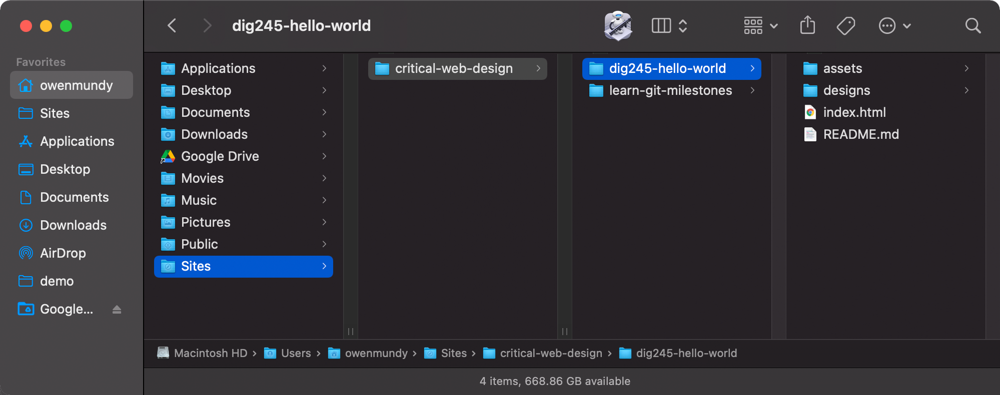
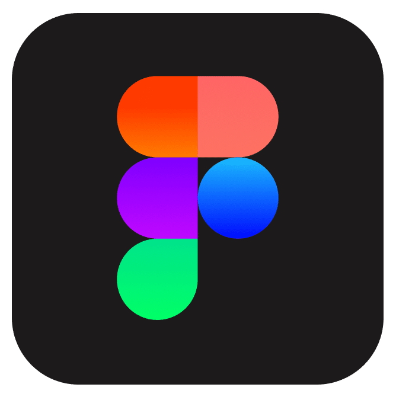
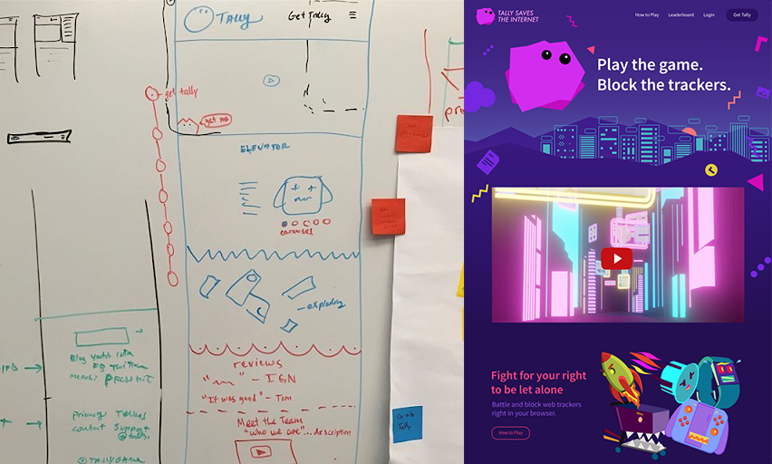
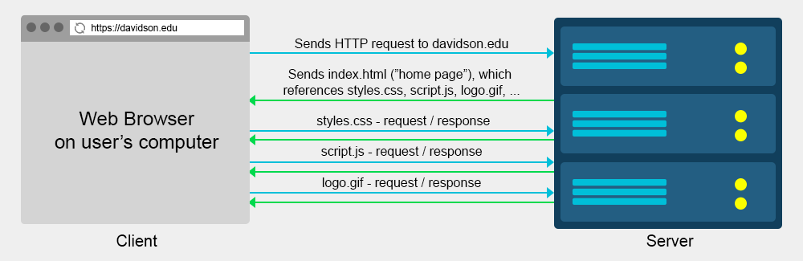
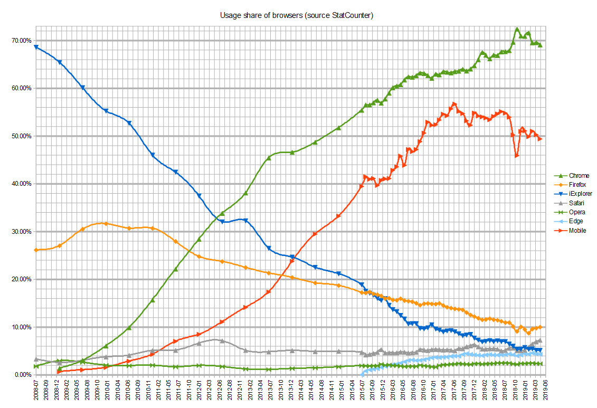
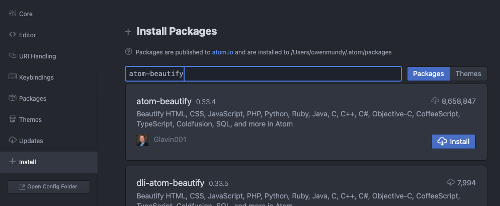

[<](../../README.md)

# Web Development Environment

<!--

Set up your web development environment!

### Contents

1. [Learning Objectives](#learning-objectives)
1. [Class communication](#class-communication) `1 min`
1. [Visual editors](#visual-editors) `2 min`
1. [Web Browsers](#web-browsers) `10 min`
1. [Text Editor](#web-browsers) `10 min`
1. [Discussion](#discussion) `5 min`
1. [References](#references)

## Learning Objectives

Students who complete the following will be able to:

- Discuss popular web browsers, and rank them by browser market share
- List essential tools for frontend web development and describe their purpose
- Recall popular code editors and their features
- Demonstrate how to install and configure software for a web development environment

-->

Get ready for this course. Install / create accounts:

1. [Slack](#slack) - communication
1. [Command line](#command-line) - basic computing
1. [Project folder](#project-folder) - where you'll keep all your projects for the class
1. [Visual editor](#visual-editor) - design
1. [Web browsers](#web-browsers) - to test your web pages
1. [Code Editors](#code-editors) - to build
1. [Version Control](#version-control) - to access class demos, manage code versions, and turn in assignments

## Slack

- Class communication will happen via [Slack](https://slack.com/).
- [Download](https://slack.com/download) the desktop and mobile app and enable notifications.
- Watch for an invitation to join the class Slack.

## Command line

- The command line allows you to control your computer via a text interface.
- Complete the [command line crash course](https://github.com/omundy/learn-computing/blob/main/topics-command-line.md#crash-course) before proceeding.

Follow instructions (below) to set up your project folder.

## Project folder

This will be the main folder for all your class projects, and will be used in all class tutorials.

1. Go to your [home folder](https://github.com/omundy/learn-computing/blob/main/topics-files-folders.md) - Path is:
	- Mac: `/Users/<yourusername>/`
	- Windows: `C:\Users\<yourusername>\`
1. Create a new folder in your home called Sites (yes, uppercase S) - Path should now be:
	- Mac: `/Users/<yourusername>/Sites/`
	- Windows: `C:\Users\<yourusername>\Sites\`
1. Create a new folder in Sites called `critical-web-design` - Path should now be:
	- Mac: `/Users/<yourusername>/Sites/critical-web-design/`
	- Windows: `C:\Users\<yourusername>\Sites\critical-web-design\`

Wireframes / post-it note brainstorm on the left, Photoshop mockup on the right. [View final version](https://tallysavestheinternet.com/).

## Visual Editor

You need a visual editor to design websites

- It is essential to pre-visualize what you plan to code, before you code.
- Good design requires iteration. It allows you to compare and improve on previous versions.
- When you design you need to make and judge lots of visual changes quickly. Coding is slow.

### Recommendation

1. Start with pencil / paper or whiteboard to create [wireframes](https://www.google.com/search?q=wireframe&sxsrf=ALeKk00LBL378L-L6vFVoAIpOtV5ohu-Ag:1628726643589&source=lnms&tbm=isch&sa=X&ved=2ahUKEwiVu5vIl6ryAhWkRDABHYgVDr8Q_AUoAXoECAEQAw&biw=1920&bih=1096).
1. Transition to [Figma](https://www.figma.com/).
	- Use a free [account](https://www.figma.com/)
	- Create designs that exactly match (color, resolution, graphics) what you will code.
	- You can even prototype your projects, adding [animation](https://help.figma.com/hc/en-us/articles/360039818874-Create-advanced-animations-with-Smart-Animate) and [interaction](https://www.youtube.com/watch?v=-sAAa-CCOcg)

#### Comparison

Product | Cost | Description | Cons
--- | --- | --- | ---
[Figma](https://www.figma.com/) | [free](https://www.figma.com/pricing/) | Widely used to layout, illustrate, animate, and prototype websites and apps. | ?
Photoshop | $$$ | Industry standard, uses pixels, capable of web design and much more. | Expensive. Large learning curve.
Illustrator | $$$ | Excellent at vector graphics, therefore should only be used for illustration and print work. | Expensive. Large learning
[Gimp](https://www.gimp.org/) | free | Open source Photoshop alternative. Opens PSDs. [Tutorials available](https://www.google.com/search?q=gimp+web+design+tutorial). | Interface can feel clunky. Not widely used.

*Use Adobe products for free in VAC 212 (CAT Card access 8am–1am).

## Web Browsers

A web browser is more than the software we use to access data on the internet. Browsers manage requests for hundreds of remote files on web servers, combine and render response data as media-rich "web pages", and make them interactive to provide the essential hyperlink ([1965](https://en.wikipedia.org/wiki/Hyperlink#History)) function that "connects"" information on the internet.

For every page visited:

1. A user clicks on a link on a page in the browser
1. The browser [requests](https://bytesofgigabytes.com/networking/how-http-request-and-response-works/) the new page from that website server (the computer where the files are stored)
1. The browser receives a response, and requests all other content (stylesheets, scripts, images, etc) for the page
1. Finally, the browser renders the all this content on a user's device and they continue the process.

### The Browser Wars

Browsers are not all created the same. Some only run on desktop or mobile. Others only run on specific operating systems. There are big differences in how browsers follow (or not!) the [WC3 standards](https://www.w3.org/standards/) when they render the pages you build. Even the browser versions can be quite distinct. Ask any veteran web developer what it was like to work around the bugs on [Internet Explorer 6](https://www.theverge.com/2014/4/8/5593584/the-most-hated-browser-in-the-world-is-finally-dead)!

Graphic depicting usage share during the 2nd <a href="https://en.wikipedia.org/wiki/Browser_wars">browser wars</a> (2008–)

Since the browser is the primary vehicle through which users will encounter your web pages, it follows that it is essential to test your coded pages in the same environment. It would be overwhelming to test every page in all the [different browsers, operating systems, and display sizes that are available](https://en.wikipedia.org/wiki/List_of_web_browsers), but lucky for us, some browsers are more popular than others.

### Discussion

With your group, examine the following table containing usage share on ***all*** (desktop and mobile) browsers:

1. What do you notice?
2. Based on this data, what do you think the three most important browsers are to install and use in testing?

Browser | [StatCounter](https://gs.statcounter.com/browser-market-share) 8/2021 | [Wikimedia](https://analytics.wikimedia.org/dashboards/browsers/#all-sites-by-browser) 11/2019 | Platform(s)
--- | ---: | ---: | ---
 [Google Chrome](https://www.google.com/chrome/)* | 65.1% | 48.7% | Windows, MacOS, iOS, Linux
 [Safari Browser](https://www.apple.com/safari/) | 18.6% | 22.0% | MacOS & iOS only 😢
 [Firefox Browser](https://www.mozilla.org/en-US/firefox/new/) | 3.4% | 4.9% | Windows, MacOS, iOS, Linux
 [Microsoft Edge](https://www.microsoft.com/en-us/edge)* | 3.4% | 1.9% | Windows, MacOS
 [Samsung Internet](https://en.wikipedia.org/wiki/Samsung_Internet)* | 3.1% | 2.7% | Android & Tizen only 😢
 [Opera Browser](https://www.opera.com/)* | 2.1% | 1.1% | Windows, MacOS, iOS, Linux
 [Internet Explorer](https://www.opera.com/) | 0.6% | 3.9% | Windows only 😢
Others | 4.6% | 14.5% | ---

*Desktop or mobile version (or both) based on  [Chromium](https://en.wikipedia.org/wiki/Chromium_(web_browser)) like  [Brave](https://brave.com/). ([logos](https://github.com/alrra/browser-logos))

Next, compare the data from the Wikipedia [browser usage share article](https://en.wikipedia.org/wiki/Usage_share_of_web_browsers#Summary_tables), the [StatCounter](https://gs.statcounter.com/browser-market-share), and [Wikimedia](https://analytics.wikimedia.org/dashboards/browsers/#all-sites-by-browser).

3. What do you notice now?
4. Did your top three browsers change?

Click to learn which browsers you should install

#### Recommendation

Did you guess, "I should install all of them?" That's not an incorrect answer. Two important things to learn from the above:

- 50% of all users are now mobile users. This affects not only the browsers you test on but how you accommodate different display resolutions and devices.
- And, Chrome is a clone, but it is far and wide the most popular iteration of the Chromium browser.

## Code Editors

There are many great source code editors, like [Sublime text](https://www.sublimetext.com/) and [VS (Visual Studio) Code](https://code.visualstudio.com/), which are also both multi-platform, free, and highly capable. However, my preferred editor for web development, and this class, is Atom.

## Install and Configure VS Code

VS Code is a free source code editor for macOS, Linux, and Windows. It has support for extensions to add functionality to the editor and embedded Git controls. VS Code is developed Microsoft.

Download and install [VS Code](https://code.visualstudio.com/download) then install the following extensions:

- [open in browser](https://marketplace.visualstudio.com/items?itemName=techer.open-in-browser) to open a page in your default web browser

### Install Atom

Atom *was* a free and open-source source code editor for macOS, Linux, and Windows. It has support for plug-ins written in JavaScript, embedded Git controls, and is developed by GitHub.

Download and install [Atom](https://atom.io/). Then, install the following packages in Atom > Settings:

- [atom-beautify](https://atom.io/packages/atom-beautify) - Beautify HTML, CSS, JavaScript, PHP, Python, etc. code to make it more readable.
- [emmet](https://atom.io/packages/emmet) - The essential tool for web developers
- [file-icons](https://atom.io/packages/file-icons) - Assign file extension icons and colours for improved visual grepping
- [pigments](https://atom.io/packages/pigments) - A package to display colors in project and files
- [linter-jshint](https://atom.io/packages/linter-jshint) - [linter](https://en.wikipedia.org/wiki/Lint_(software)) for JavaScript; [jshint docs](https://jshint.com/docs/options/), sample `.jshintrc` [browser](https://github.com/omundy/sample-extension-listener/blob/master/.jshintrc) and [node](https://github.com/omundy/sample-node-osm-leaflet/blob/master/.jshintrc) (this will also prompt to install dependent packages like [linter](https://atom.io/packages/linter))
- [open-file](https://atom.io/packages/open-file) - Open a file from Atom in your default app (e.g. web browser)
- [open-terminal-here](https://atom.io/packages/open-terminal-here) - Open the command line in the location you choose in the tree view.

#### Optional

- On Windows the [copy-path](https://atom.io/packages/copy-path) can convert backslashes to forward slashes, which are required for paths on the www.

### How to install a package in Atom:

1. Access Settings:
	- Use the key command: `CMD + ,`
	- or choose Atom > Preferences > Settings
	- or choose Packages > Settings View
1. In Settings, click on the Install tab and search for a package
1. Verify the name (they don't always sort correctly by popularity) and click Install

### Atom Tips

#### Hide Ignored Names
To keep `.git` and `.DS_store` files from cluttering up the tree view:
1. Go go Settings → Packages
1. Search for "Tree View"
1. Check `Hide Ignored Names`

### Open a project folder in Atom
Any of the below:
- Atom: Choose File > Open and select the folder
- Finder: Drag the project folder into the Atom icon in the dock (Mac)
- Github Desktop:
	- Choose Repository > Open in Atom
	- Or press Command + A

#### Open a project in Atom from the command line in MacOS
1. Click Atom → Install Shell Commands
1. In Terminal, `cd` to the directory you want to open
1. Type `atom .` to open the current directory in the editor

#### Format "beautify" your code
This is essential for source code editing. In any file, either
- press `Ctl + Option + B`
- or choose Packages → Atom Beautify → Beautify

## Version Control

We will be using Git and Github Desktop for version control, demos, turning in assignments, and collaboration.

- After you finish the above, start reviewing the [Git & Github Desktop slides](https://docs.google.com/presentation/d/1vtK6LoqwF4rQQZZy-ovuEgsYUwwMRXsqDVMOjAPSBt0/edit#slide=id.g9165d0d9fd_0_120).
