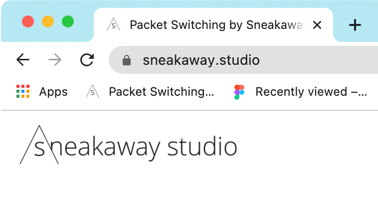

[<](../../README.md)

# Favicons

Favicons (short for "favorite icons") are the small images used to identify web pages in browser tabs and bookmarks. Above, you can see the favicons for Sneakaway Studio and Figma in the page's tab and bookmarks bar.

## How to make a favicon

Favicons are relatively easy to create.

1. Create an image or icon at least 128 pixels square. Keep in mind it will be resized to 16x16 and 32x32 depending on the location it is viewed.
1. Save it as a .png file.
1. Use a [free online converter](https://favicon.io/favicon-converter/) to export the right formats.
1. Add the files and code to your website

## How to make an emoji favicon

The favicon.io site offers two other methods that are even easier:

- Choose your own text and colors to [generate](https://favicon.io/favicon-generator/) your favicon
- Select an [emoji](https://favicon.io/emoji-favicons/) to make your favicon

... and download and install the file(s).
