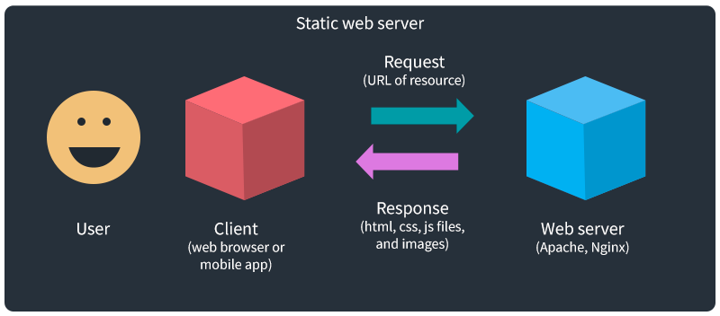
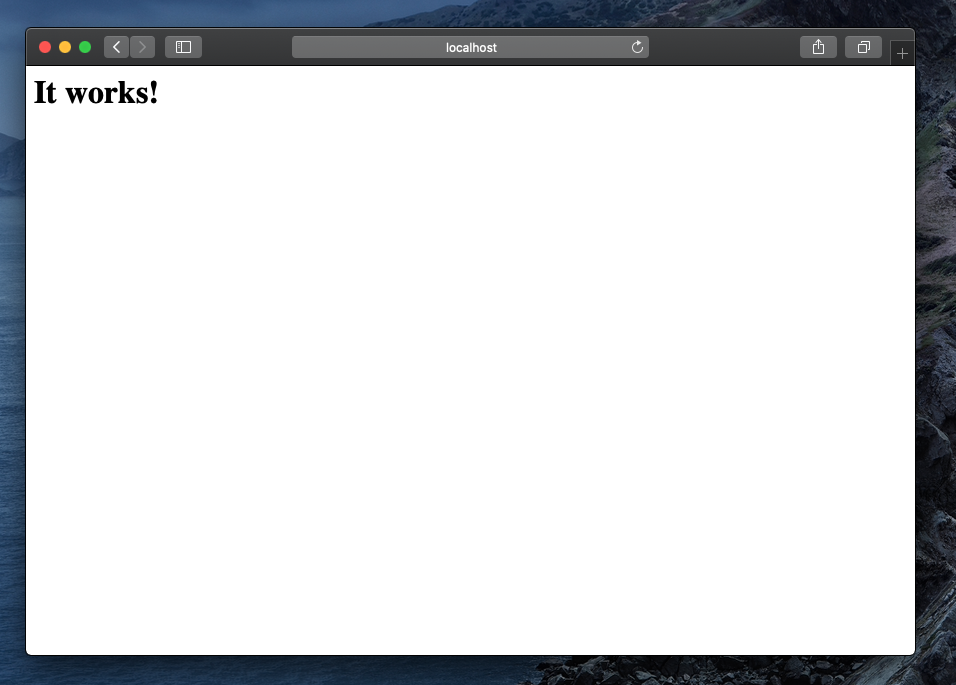

[<](../../README.md)


# Web Servers

An overview of servers, including installing development servers, DNS, CDNs, FTP, and more.

### Contents

1. [Learning Objectives](#learning-objectives)
1. [Introduction](#introduction) `5 min`
1. [Discussion](#discussion) `5 min`
1. [References](#references)

## Learning Objectives

Students who complete the following will be able to:

- Discuss the difference between the WWW and the Internet
- Describe the essential components of today's internet system
- Recall
- Demonstrate how to publish a website


## What is a website?

A website consists of several parts:

- The files: HTML and CSS code, the text or data for the website, and all assets like images, scripts, and other media files.
- A public web server which “hosts” or “serves” those files to computers that request your website.*
- An easy to remember domain name, like “google.com,” that you register so users can request your website files.*
- The domain name system (DNS), where your registered domain name points to your physical server or cloud operation.
- Git or an SFTP application to put and update the files that make up your website.
- Finally, the HTML and CSS code you write are just plain text files until someone actually uses a web browser to render them.


## What is a server?

There are many types of web servers available today. In its most basic form, a web server is a computer that has special software that can accept **requests** (via URLs) and return **responses** (text files like html, css, js, or media like images, video, audio, etc.).




### WWW vs The Internet

### Essential Web Technology

- Packet Switching
- TCP/IP


## Domain Name System (DNS)

The Domain Name System (DNS) is a central part of the Internet, providing a way to match names (the website you’re seeking) to numbers (the IP address for the website).

### Discussion

- Use PING to see this in action...


## Web Hosting

When you register your domain name you tell the domain name registrar the address of your server.
When a user requests files from your site then your computer makes a request to your web host, which returns those files for the browser to render.


## Domain name availability

- Use a whois service to check the availability of the domain name you want to use.
- For example, this site is not available davidson.edu


### Domain Name Tools

- [ICANN Lookup](https://lookup.icann.org/en/lookup) - Whois and availability
- [who.is/](https://who.is) - Whois and availability [example](https://who.is/whois/owenmundy.com)
- [tld-list.com](https://tld-list.com) - Search domain name availability
- [Spaceship](https://www.spaceship.com/domain-search) - Domain name registrar with nice search interface
- [Cloudflare](https://domains.cloudflare.com/) - Affordable domain name registrar
- [gandi.net][https://www.gandi.net] - Domain name registrar "for a secure online space"


## Publishing


### FTP / SFTP

Using FTP (File Transfer Protocol) to manage server files but there are drawbacks:

- Manual process takes longer
- Easier to make mistakes
- No backups


### Git

Publishing a website on a server with Git / Github makes it much easier to maintain projects.

- Automated tools
- Entire project is duplicated
- You can control versions
- You always have backup if you make a mistake


## CDN

A content delivery network can speed up your websites but they also create caching issues.


### Caching

- Browsers, switches, ISPs, CDNs all use caches to speed up content delivery.
- As a developer you do not want to see the cached content. Hold SHIFT and click refresh.


## Development Servers

Generally speaking, a **production server** is the live website or web application that is available to the world. A **development server** is a separate machine where you can build, test, and/or stage your work until it is ready to go live.

You can create a development server on a remote machine, or your personal computer. Your development server should match the **environment** (server software version, settings, etc.) of the production server as much as possible.


---


### Install Apache on a Mac

The most popular server software are free and open source:

1. [Apache HTTP Server](https://httpd.apache.org/)
1. [Nginx](https://www.nginx.com/)

MacOS (releases before 2022) already has Apache and PHP installed. To enable them, it is usually best to search the web for a tutorial that matches your version. For example [High Sierra (10.13)](https://websitebeaver.com/set-up-localhost-on-macos-high-sierra-apache-mysql-and-php-7-with-sslhttps), [Mojave (10.14)](https://jasonmccreary.me/articles/install-apache-php-mysql-mac-os-x-mojave/), or [Catalina (10.15)](https://tech-cookbook.com/2019/10/07/setting-up-your-local-server-on-macos-catalina-2019-mamp/). The basics process is:

1. Start the server (`sudo` means you are performing a command as a "superuser" and will require a password)

```bash
sudo apachectl start
```

At this point you can visit http://localhost/ to see if it works.



Now you'll need to change some configuration options...

2. Make a backup of your Apache configuration file

```bash
sudo cd /etc/apache2/
sudo cp httpd.conf httpd.conf.bak
```

3. Edit the configuration file

```bash
sudo nano httpd.conf
```

4. Configuration => Uncomment the following line (remove #) to enable PHP

```text
LoadModule php7_module libexec/apache2/libphp7.so
```

5. Configuration => Set the web server directory by replacing both instances of

```
/Library/WebServer/Documents
```

with this, replacing `<username>` with your own:

```
/Users/<username>/Sites
```

6. Configuration => Enable index viewing by searching for these directives

```
Options FollowSymLinks Multiviews
```

... and adding `Indexes` so it looks like

```
Indexes Options FollowSymLinks Multiviews
```


7. Finally, restart the server and you should see a list of the files in your Sites directory at http://localhost/

```bash
sudo apachectl restart
```


### Other methods for running a local development server

You can also use [homebrew]() to [install Apache server](https://medium.com/@crmcmullen/how-to-install-apache-on-macos-10-13-high-sierra-and-10-14-mojave-using-homebrew-3cb6bf6e3cd4)


---

### Other Server Types


---

### Python http.server

Use Python [http.server](https://docs.python.org/3.9/library/http.server.html#module-http.server) to run a server on your computer (see also [PHP or node](https://css-tricks.com/snippets/html/start-a-web-server-with-one-terminal-command-on-os-x/)).

1. In Terminal, change `cd` to the location to run the server. This directory should exist.

```bash
# location of a Git repository
cd /Users/owenmundy/Documents/GitHub/<your-repository-name>
# or your the Sites directory in your home folder
cd ~/Sites/
```

2. Start the Python server, where `7777` is the port you wish to use:

```bash
python -m http.server 7777 # Python 3 version (try this first)
python -m SimpleHTTPServer 7777 # Python 2.7 (older)
```

3. Go to http://0.0.0.0:7777 in your web browser. To stop the server use <kbd>Ctl</kbd> + <kbd>C</kbd>


---

## Linux web servers

Following are notes applicable to many Mac and Linux web server software.


---


### Linux: Set the hostname

View/edit the [hostname](https://www.commandlinux.com/man-page/man1/hostname.1.html) on Linux (tested in on Debian Jessie and Raspberry Pi OS).

```bash
hostname            # view name of the machine on the network
hostnamectl         # view hostname, etc.
cat /etc/hostname   # view the hostname directly
cat /etc/hosts      # view the hosts file, that map names to IP addresses
```

To change the hostname, edit the file, or use [`hostnamectl`](https://man7.org/linux/man-pages/man1/hostnamectl.1.html)

```bash
sudo nano /etc/hostname   # view the hostname directly
hostnamectl set-hostname chip1  # set the hostname
sudo reboot                 # reboot to take effect
```

- [Debian Linux: Change Hostname / Computer Name Permanently](https://www.cyberciti.biz/faq/debian-change-hostname-permanently/)
- [Pi WebServer Project](https://www.slicethepi.co.uk/pi_server/)
- [Server World > Set Hostname](https://www.server-world.info/en/note?os=Debian_8&p=hostname)


## Discussion

-

## References

-
